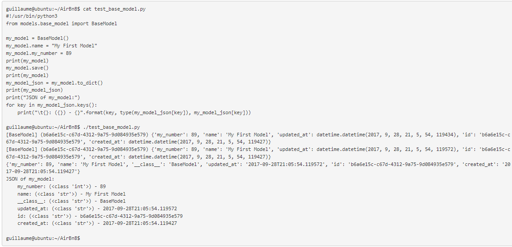
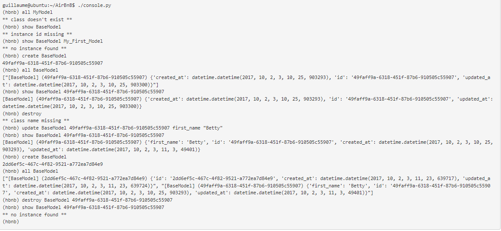

[⬇️Go straight to bottom](#license-and-contribution-)
<br>
# HBNB - Command Line Interface

> THe HBNB console is the first step in an attempt to clone the known [AirBnb](https://www.airbnb.com/) site. The console is a commmand line interface that enables the user manage models, i.e perform crate, read, update, delete,.. operations on the models. *“model” in a OOP project is the representation of an object/instance.*


<br>
<br>
<br>

# Navigate
* [Project concept?](#----------concept---------)
* [How does it work, how to get it working locally?](#----------technical---------)
* [Pitfalls/Bugs?](#bugs-)
* [Official](#license-and-contribution-)
* [Sauce coders](#author-)

<br>

# --------- CONCEPT --------

## The console ⚡

* create your data model
* manage (create, update, destroy, etc) objects via a console / command interpreter
* store and persist objects to a file (JSON file)
* The first piece is to manipulate a powerful storage system. This storage engine will give us an abstraction between “My object” and “How they are stored and persisted”. This means: from your console code (the command interpreter itself) and from the front-end and RestAPI you will build later, you won’t have to pay attention (take care) of how your objects are stored.

* This abstraction will also allow you to change the type of storage easily without updating all of your codebase.

* The console will be a tool to validate this storage engine

> pictorial representaion of the role of the console

<br>
<br>

## Storage 💾

Persistency is really important for a web application. It means: every time your program is executed, it starts with all objects previously created from another execution. Without persistency, all the work done in a previous execution won’t be saved and will be gone.

In this project, you will manipulate 2 types of storage: file and database. For the moment, you will focus on file.

Why separate “storage management” from “model”? It’s to make your models modular and independent. With this architecture, you can easily replace your storage system without re-coding everything everywhere.

You will always use class attributes for any object. Why not instance attributes? For 3 reasons:

* Provide easy class description: everybody will be able to see quickly what a model should contain (which attributes, etc…)
* Provide default value of any attribute
* In the future, provide the same model behavior for file storage or database storage
<br>

<br>

## Data-diagram 🧮

> pictorial representation of model relationship

<br>
<br>
<br>

# --------- TECHNICAL --------

## Files and Directories 📂

* [`models`](#) directory contains all classes used for the entire project. A class, called “model” in a OOP project is the representation of an object/instance.
* [`models`](#) directory contains all classes used for the entire project. A class, called “model” in a OOP project is the representation of an object/instance.
* [`tests`](#) directory contains all unit tests.
* [`console.py`](#) file is the entry point/CLI of our command interpreter.
* [`models/base_model.py`](#) file is the base class of all our models. It contains common elements:
    > attributes: id, `created_at` and `updated_at`
    >
    > methods: `save()` and `to_json()`
* [`models/engine`](#) directory will contain all storage classes (using the same prototype). For the moment you will have only one: file_storage.py.

## How to setup locally 🏁
> I assume you're working on a linux machine, Arch Linux preferably 🙂

To get a copy of the repo and test on you machine please follow the steps below

* clone repo
```bash
$ git clone <repo-link>
```
* cd into repo dir
```bash
$ cd ./AirBnb_clone
```
* run `console.py`
```bash
$ ./conole.py
```
<br>

## How does the whole thing work?? ⚙
This is divided into two aspects, namely:
<br>

### How can I store my instances? ⚙

That’s a good question. So let’s take a look at this code:

```bash
class Student():
    def __init__(self, name):
        self.name = name

students = []
s = Student("John")
students.append(s)
```
Here, I’m creating a student and store it in a list. But after this program execution, my Student instance doesn’t exist anymore.

```bash
class Student():
    def __init__(self, name):
        self.name = name

students = reload() # recreate the list of Student objects from a file
s = Student("John")
students.append(s)
save(students) # save all Student objects to a file
```

Nice!

But how does it works?

First, let’s look at `save(students)`:

* Can I write each `Student` object to a file => NO, it will be the memory representation of the object. For another program execution, this memory representation can’t be reloaded.
* Can I write each `Student.name` to a file => YES, but imagine you have other attributes to describe `Student`? It would start to be become too complex.

The best solution is to convert this list of Student objects to a JSON representation.

Why JSON? Because it’s a standard representation of object. It allows us to share this data with other developers, be human readable, but mainly to be understood by another language/program.

Example:

* My Python program creates Student objects and saves them to a JSON file
* Another Javascript program can read this JSON file and manipulate its own Student class/representation
And the `reload()?` now you know the file is a JSON file representing all Student objects. So reload() has to read the file, parse the JSON string, and re-create Student objects based on this data-structure.

Here's what it looks like:

> pictorial representation of the functionality of interacting with models

<br>

### How does the console work? ⚙

There's another good question!

Here are some of the console commands and what they do:

* `create()`: Creates a new instance of BaseModel, saves it (to the JSON file) and prints the id. Ex: `$ create BaseModel` or `BaseModel.create()`

* `show()`: Prints the string representation of an instance based on the class name and id. Ex:`$ show BaseModel 1234-1234-1234` or `BaseModel.show("1234-1234-1234")`.

* `update()`: Updates an instance based on the class name and id by adding or updating attribute (save the change into the JSON file). Ex: `$ update BaseModel 1234-1234-1234 email "aibnb@mail.com"` or `BaseModel.update(("1234-1234-1234"){"email":"aibnb@mail.com"})`.

* `destroy()`: Deletes an instance based on the class name and id (save the change into the JSON file). Ex: `$ destroy BaseModel 1234-1234-1234`.

* `count()`: Prints the number of class instances based on the class name alone. Ex: `count User` or `User.count()`

* `all()`: Prints all the class instances based on the class name alone. Ex: `all User` or `User.all()`

Here's an illustration:

> pictorial representation of the functionality of the console


<br>
<br>

# Bugs 🦠
No bugs at the moment, but if you notice any, please raise an issue.
<br>
<br>

# Author 🐱‍🏍
* [Stephen Nwankwo](https://www.linkedin.com/in/stephen-nwankwo-9876b4196/)
<br>
<br>

# License and Contribution 👨‍👩
Free to use, operating under MIT [license](#) policy
<br>

For contribution please see [contribution](#) guildlines

[⬆️Go to the top](#hbnb---command-line-interface)
